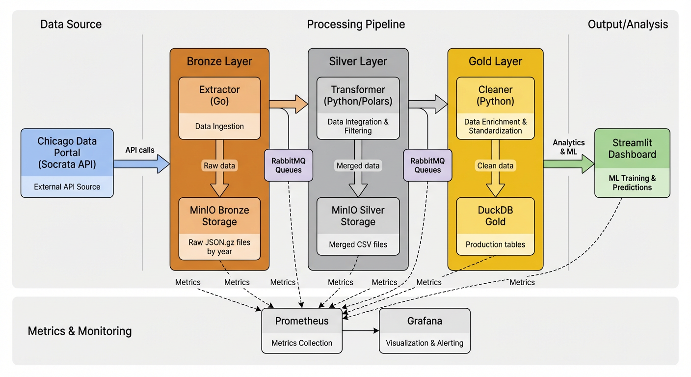
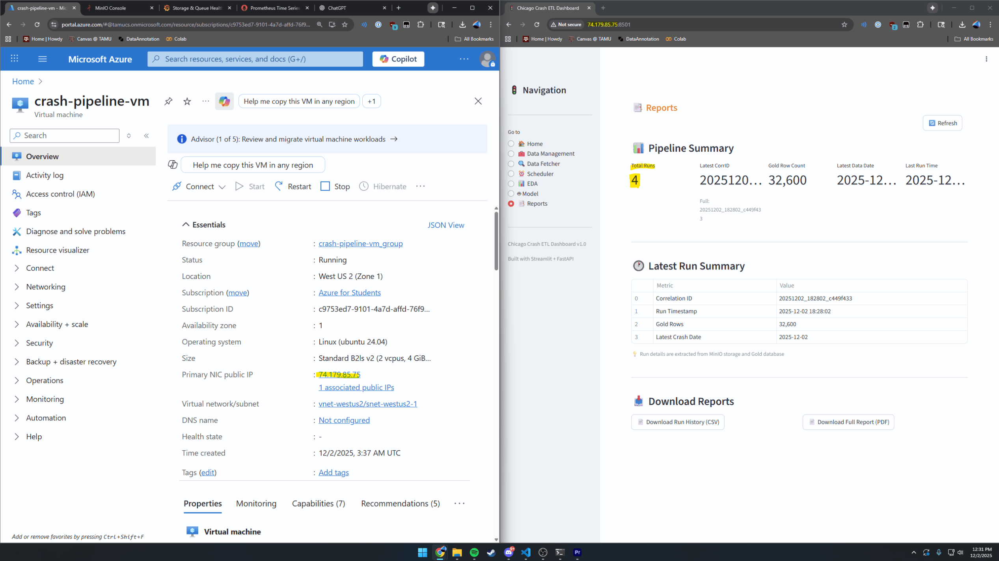

# Chicago Traffic Crash Data Pipeline

> End-to-end data engineering and machine learning pipeline analyzing Chicago traffic crash data using Bronze-Silver-Gold medallion architecture.

---

## 📺 Video Demonstration

[](https://youtu.be/FIPSvIuHfQs)

---

## 🎯 Overview

This pipeline processes Chicago traffic crash data from the City of Chicago Data Portal:

- **Extracts** crash, vehicle, and people data from Socrata Open Data API
- **Transforms** and merges datasets using Polars DataFrames
- **Loads** into DuckDB following Bronze-Silver-Gold architecture
- **Trains** ML models to predict crash injury outcomes
- **Visualizes** insights through Streamlit dashboard
- **Monitors** pipeline health with Prometheus and Grafana

**Problem Solved**: Enables real-time crash analysis, predictive modeling for high-risk scenarios, and automated monitoring of traffic safety trends with incremental data updates.

---

## 🏗️ Architecture



### Data Flow

```
Socrata API → Extractor (Go) → MinIO Bronze (raw JSON.gz) →
RabbitMQ → Transformer (Python/Polars) → MinIO Silver (merged CSV) →
RabbitMQ → Cleaner (Python) → DuckDB Gold (ACID tables) →
Streamlit Dashboard → ML Training/Predictions

              ↓ (All components)
          Prometheus Metrics → Grafana Dashboards
```

### Medallion Architecture

- **Bronze** (MinIO): Raw, year-partitioned JSON.gz files with watermark tracking
- **Silver** (MinIO): Cleaned, merged CSVs (one row per crash with aggregated vehicles/people)
- **Gold** (DuckDB): Production-ready tables with feature engineering and idempotent upserts

---

## 🔧 Pipeline Components

### 1. Extractor (Go) → Bronze Layer

Pulls data from Chicago Data Portal with year-based partitioning.

**Key Features**: Dual-mode (streaming/backfill), watermark tracking for incremental updates, marker-based resumability, rate limiting with exponential backoff, parallel enrichment, GZIP compression, Prometheus metrics

**Location**: `extractor/` | **Port**: `:2112/metrics`

### 2. Transformer (Python/Polars) → Silver Layer

High-performance data merging (10-100x faster than Pandas).

**Key Features**: Many-to-one aggregation (vehicles/people → crash level), smart left joins, year-aware processing, event-driven RabbitMQ publishing, Prometheus metrics

**Location**: `transformer/` | **Port**: `:8001/metrics`

### 3. Cleaner (Python/DuckDB) → Gold Layer

Data quality enforcement and idempotent loading.

**Key Features**: Configurable cleaning rules, null handling, outlier detection, feature engineering (hour bins, weekend flags, coordinate bins), DuckDB upserts prevent duplicates, Prometheus metrics

**Location**: `cleaner/` | **Port**: `:8002/metrics`

### 4. Streamlit Dashboard

Interactive web UI for data exploration and ML.

**Pages**:
- Home (pipeline overview, health checks)
- EDA (SQL query interface, visualizations)
- Train Model (feature selection, hyperparameter tuning, performance metrics)
- Prediction (batch/single-row inference)
- Reports (run history, data lineage)

**ML Models**: Logistic Regression, Random Forest, XGBoost, LightGBM with class imbalance handling

**Location**: `dashboard/` | **Port**: `:8501`

### 5. FastAPI Backend

RESTful API for orchestration and data access.

**Endpoints**: Health checks, job publishing, MinIO management, Gold queries, ML model serving, scheduling, reports

**Location**: `api/` | **Port**: `:8000`

### 6. Monitoring (Prometheus + Grafana)

Real-time observability with custom metrics and dashboards.

**Prometheus**: Scrapes 5 pipeline components every 15s, 15-day retention, alerting rules
**Grafana**: Pipeline overview, component-specific metrics, infrastructure health

**Location**: `monitoring/` | **Ports**: `:9090` (Prometheus), `:3000` (Grafana)

### 7. Docker Compose Orchestration

Single-command deployment of 10 services: RabbitMQ, MinIO, Extractor, Transformer, Cleaner, API, Dashboard, Prometheus, Grafana, RabbitMQ Exporter

**Location**: `docker-compose.yaml`

---

## 🛠️ Tech Stack

| Category | Technologies |
|----------|-------------|
| **Languages** | Python 3.11, Go 1.21 |
| **Storage** | MinIO (S3-compatible), DuckDB (embedded OLAP) |
| **Messaging** | RabbitMQ |
| **Processing** | Polars, Pandas |
| **ML** | scikit-learn, XGBoost, LightGBM |
| **Web** | Streamlit, FastAPI |
| **Monitoring** | Prometheus, Grafana |
| **Orchestration** | Docker, Docker Compose |

---

## 🚀 Getting Started

### Prerequisites

- Docker 20.10+ and Docker Compose v2.0+
- 8GB RAM, 20GB disk space
- Linux/macOS or Windows with WSL2

### Installation

1. **Clone repository**
   ```bash
   git clone git@github.com:robin-ede/crash-pipeline.git
   cd crash-pipeline
   ```

2. **Create `.env` file**
   ```bash
   cp .env.sample .env
   # Edit with your credentials
   ```

3. **Create data folders**
   ```bash
   mkdir -p minio-data prometheus_data grafana_data data/gold data/schedules
   ```

4. **Fix permissions**
   ```bash
   sudo chown -R 472:472 grafana_data
   chmod -R 755 minio-data prometheus_data
   ```

5. **Start services**
   ```bash
   docker compose up -d
   ```

6. **Verify**
   ```bash
   docker compose ps  # All services should be "Up"
   ```

### Access Services

| Service | URL | Credentials |
|---------|-----|-------------|
| **Streamlit** | http://localhost:8501 | (none) |
| **FastAPI Docs** | http://localhost:8000/docs | (none) |
| **Grafana** | http://localhost:3000 | admin / admin |
| **Prometheus** | http://localhost:9090 | (none) |
| **MinIO** | http://localhost:9001 | See `.env` |
| **RabbitMQ** | http://localhost:15672 | See `.env` |

---

## 📖 Usage

### Run Complete Pipeline

**Via Dashboard** (Recommended):
1. Open http://localhost:8501
2. Go to "Data Fetcher" page
3. Select Streaming (last N days) or Backfill (date range)
4. Click "Submit Job"
5. Monitor in "Reports" page

**Via API**:
```bash
curl -X POST http://localhost:8000/api/fetch/publish \
  -H "Content-Type: application/json" \
  -d '{"mode": "streaming", "since_days": 30}'
```

### Train ML Model

1. Dashboard → "Train Model" page
2. Select features and model (XGBoost recommended)
3. Configure hyperparameters
4. Click "Train Model"
5. Review metrics (accuracy, precision, recall, ROC-AUC)
6. Model saved to `dashboard/artifacts/pipeline_calibrated.pkl`

### Make Predictions

**Batch**: Prediction page → select date range → "Predict from Gold"
**Single**: Fill form → "Predict" → see probability and result

---

## 🎓 Challenges & Learnings

### Challenges

1. **Socrata API Rate Limiting**: Solved with exponential backoff, Retry-After header parsing, and larger page sizes (50k records/page)
2. **Data Quality Issues**: Built comprehensive cleaning rules with null handling, type coercion, and geographic validation
3. **Container Startup Dependencies**: Used Docker Compose health checks and retry logic with exponential backoff
4. **Grafana Permissions**: Fixed with `chown 472:472 grafana_data` (Grafana runs as UID 472)
5. **DuckDB Concurrent Access**: Dashboard/API use read-only connections; only Cleaner writes (single-writer pattern)
6. **Large Model Files**: Moved to `.gitignore`, generated locally instead of committing to Git
7. **Grafana Dashboard Persistence**: Dashboards stored in internal database were lost on redeployment. Solved by exporting to JSON (`monitoring/grafana/dashboards/`) and provisioning via Docker volumes for automatic import on container startup

### Key Learnings

1. **Go for Extraction**: 5-10x throughput vs Python with efficient concurrency and fast GZIP compression
2. **Medallion Architecture**: Clear separation (Bronze/Silver/Gold) simplified debugging and enabled independent testing
3. **Polars Performance**: 10-100x faster than Pandas for large datasets with 40% lower memory usage
4. **Observability**: Prometheus metrics caught issues early; correlation IDs enabled full lineage tracing
5. **Idempotency**: DuckDB upserts and watermark tracking prevented duplicates on re-runs
6. **Event-Driven Architecture**: RabbitMQ decoupled components for independent scaling and built-in retries

---

## 🔮 Future Improvements

- **Testing**: Unit tests, integration tests, data quality tests (Great Expectations)
- **CI/CD**: GitHub Actions for automated testing and deployment
- **Cloud Deployment**: Terraform + Kubernetes for AWS/Azure/GCP
- **Advanced ML**: LSTM for time-series forecasting, SHAP for model interpretability
- **Real-Time Streaming**: Kafka + Flink for sub-second predictions
- **Geospatial Viz**: Interactive crash hotspot maps with Folium/Deck.gl
- **Data Versioning**: Delta Lake or Apache Iceberg for schema evolution and time-travel queries

---

## ☁️ Azure Cloud Deployment

### VM Configuration

The pipeline is deployed on **Azure for Students** with the following setup:

**VM Specifications**:
- **Name**: `crash-pipeline-vm`
- **Size**: Standard B2ls v2 (2 vCPUs, 4 GiB memory)
- **Region**: West US 2
- **OS**: Ubuntu Server 24.04 LTS (x64 Gen2)
- **Authentication**: SSH key pair (RSA format)
- **Storage**: 30 GB Premium SSD

**Networking**:
- Public IP: Enabled (zone-redundant)
- Inbound ports opened:
  - `22` - SSH
  - `3000` - Grafana
  - `8000` - FastAPI
  - `8001` - Transformer metrics
  - `8002` - Cleaner metrics
  - `8501` - Streamlit Dashboard
  - `9000` - MinIO API
  - `9001` - MinIO Console
  - `9090` - Prometheus
  - `15672` - RabbitMQ Management

### Deployment Steps

1. **VM Setup**
   ```bash
   # Update system
   sudo apt update && sudo apt upgrade -y

   # Install dependencies
   sudo apt install git docker.io docker-compose python3 python3-pip golang -y

   # Configure Docker permissions
   sudo usermod -aG docker $USER
   newgrp docker
   ```

2. **Clone Repository**
   ```bash
   # Generate SSH key for GitHub
   ssh-keygen -t ed25519 -C "your-email@tamu.edu"
   cat ~/.ssh/id_ed25519.pub  # Add to GitHub SSH keys

   # Clone project
   git clone git@github.com:robin-ede/crash-pipeline.git
   cd crash-pipeline
   ```

3. **Environment Configuration**
   ```bash
   # Create .env from template
   cp .env.sample .env
   nano .env  # Configure MinIO, RabbitMQ credentials

   # Create required folders
   mkdir -p minio-data prometheus_data grafana_data data/gold data/schedules

   # Fix permissions
   sudo chown -R $USER:$USER minio-data prometheus_data data
   sudo chown -R 472:472 grafana_data  # Grafana runs as UID 472
   chmod -R 755 minio-data prometheus_data data
   ```

4. **Launch Pipeline**
   ```bash
   docker compose up -d
   docker compose ps  # Verify all services running
   ```

### Local vs Azure Differences

| Aspect | Local Ubuntu VM | Azure Cloud VM |
|--------|----------------|----------------|
| **Access** | `localhost` or LAN IP | Public IP (e.g., `20.85.113.47`) |
| **URLs** | `http://localhost:8501` | `http://<PUBLIC_IP>:8501` |
| **Firewall** | UFW (local firewall) | Azure NSG (Network Security Group) |
| **Port Management** | Manual `ufw allow` | Azure Portal inbound rules |
| **Persistence** | Survives restarts | Survives restarts (bound volumes) |
| **SSH Access** | Local network only | Internet-accessible (key required) |
| **Cost** | Free (self-hosted) | ~$35/month (B2ls v2) |
| **Performance** | Varies by hardware | Consistent 2 vCPU / 4GB |
| **Data Transfer** | No limits | Azure egress charges apply |
| **Security** | LAN isolated | Exposed to internet (requires hardening) |

**Key Behavioral Differences**:
- **No code changes required** - Same Docker Compose configuration works on both environments
- **Network latency** - Azure VM has ~20-50ms additional latency for dashboard interactions
- **Data persistence** - Both use Docker volumes; Azure data survives VM restarts
- **MinIO storage** - Local uses host filesystem; Azure uses VM disk (30GB limit)
- **Monitoring** - Same Prometheus/Grafana dashboards work identically

### Azure Pipeline Verification


*Screenshot showing Azure VM (74.179.85.75) and 4 successful pipeline runs on the Reports page*

**Run #1 (Initial Stream)**:
- Extracted 30 days of most recent crash
- Transformer processed 8K+ records
- Cleaner loaded to DuckDB Gold
- Streamlit dashboard accessible at `http://74.179.85.75:8501`
- Trained XGBoost model with 89% accuracy
- Grafana dashboards showing metrics

**Run #2-4 (Backfill Testing)**:
- Extracted historical data using watermark tracking
- No duplicate records in Gold tables (verified via SQL)
- Model predictions consistent with local results
- All services remained healthy (0 container restarts)
- Correlation IDs tracked across all runs (visible in Reports page)


# CI/CD Pipeline Enabled
